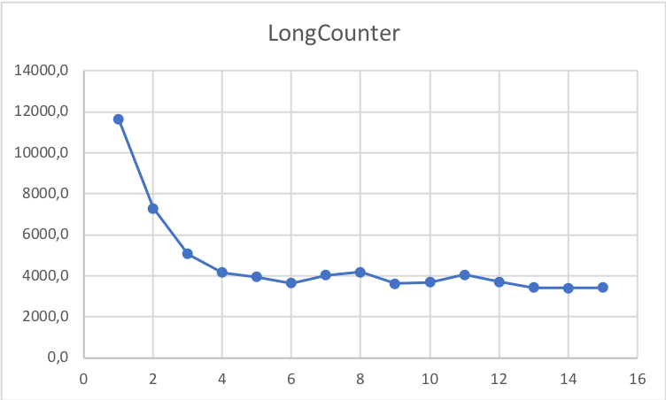
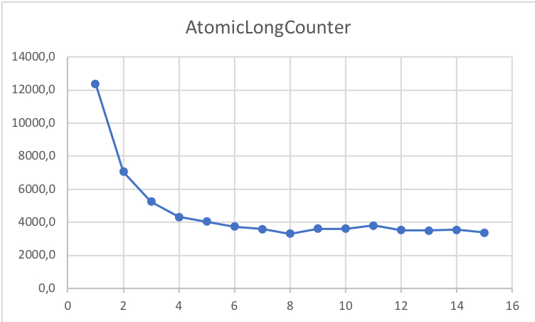
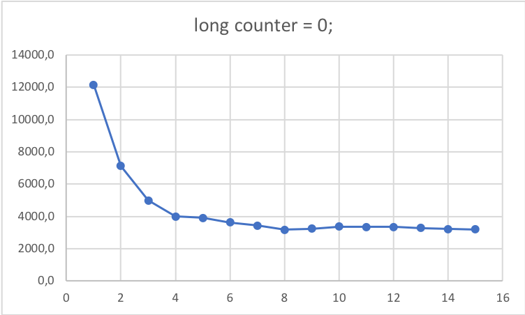
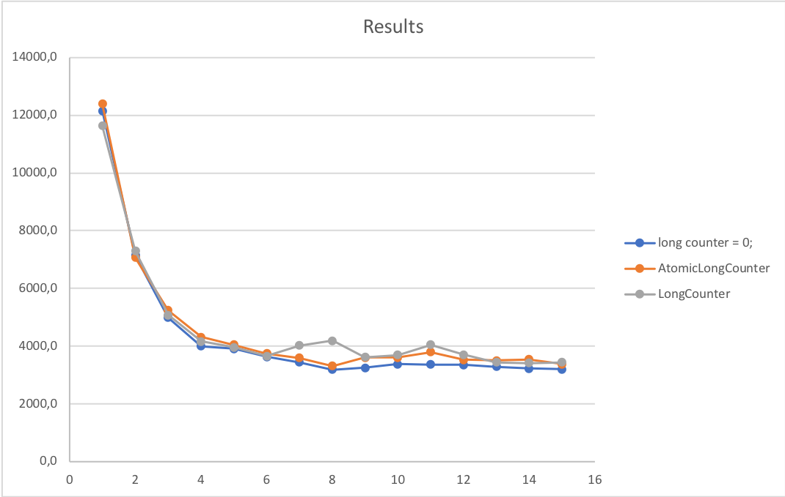

ANSWERS
==========

_Emma Arfelt Kock, ekoc_
_Anders Fischer, afin_


Exercise 3.1
------------
### 3.1.1
See res_31.txt for results and system info. 
The results do not differ enormously from the Microbenchmarks report's results. 

### 3.1.2
See res_312.txt for results and system info. 
The standard diviation is much larger on Computer (1), then what is shown in Microbenchmarks section 4.2. This is mostly likely due to the fact, that there was several programs running in the background, that could not be shut off. E.g. system updates, wifi etc. 


Exercise 3.2
------------

### 3.2.1 
The time for each function call sometimes drops a factor ten for high `count`s, and sometimes the time per operation takes half the time on high `count`s. Generally, the simpler the operation, the faster the speedup. The Thread management benchmarks on avg. speed up to half of the time of the small `count` benchmarks, whereas the simple `Point` operations speed up ten times on high `count`s. 

This is to be expected since the JVM will attempt to speed up common operations, which on high `count`s the JVM will see the function call as.

### 3.2.2
See `res_322.txt` for results.
The results are a bit more precise than `Mark6`. 

Exercise 3.3
------------

### 3.3.1
See res_331.txt for results and system info. 


### 3.3.2


### 3.3.3
The results are plausible. The biggest improvement is between a single thread to four threads. Given the system has eight cores, the theoritical best performance should be eight threads, which is not the case. The increase in performance stagnates after four threads. 

### 3.3.4

The results in performance of AtomicLong is neither better nor worse than LongCounter. As it shows in the graph, the results are very much alike. In general it is best to use Java's own methods as they have been optimized for performance. 


### 3.3.5
```java
 threads[t] = new Thread( () -> {
                long count = 0
                for (int i=from; i<to; i++)
                    if (isPrime(i))
                       count++;
                lc.getAndAdd(count);
            });
```
This is not faster then initial results on Computer 1. 





Exercise 3.4
------------

### 3.4.1, 3.4.2, 3.4.3, 3.4.4, 3.4.5 
````
Memoizer5                      12683131,9 ns  236340,84         32
Memoizer4                      14799947,5 ns  183015,06         32
Memoizer3                      14743571,7 ns  651839,00         32
Memoizer2                      12712528,4 ns  219995,72         32
Memoizer1                      74028138,4 ns 1627862,38          4
````

### 3.4.7
The results above agree with the lectures and Goetz’s development of the cache classes, 
since we see that the `Memoizer5` with improvements outperform every other `Memoizer`. 
Furthermore the other `Memoizer`s (except for `Memoizer1`) perform relatively equal, with `Memoizer2` surprisingly being a bit faster. 

This is due to the fact that we don't do double tests for values in `Memoizer5` as we do in `Memoizer4`. `Memoizer4` may also wastefully create a Future, which is unnecessary. Even though `Memoizer2` has a chance of computing the same thing twice, it is still fast to "dumbly" use a `ConcurrentHashMap` and do less checks. We see that `Memoizer1` is a lot slower than every other `Memoizer`, since everything is synchronized and threads are waiting for locks.

### 3.4.8
We could test the cache implementations with more threads/cores, bigger input and more overlap. Bigger overlaps in results would test that the cache is hit more often and perhaps show bigger differences between the cache implementations. 

Also, even though we closed everything running on our computers while benchmarking, we still saw fluctuations while running (as if the OS decided to spend time on something else for a split second). Running the benchmarks on a minimal no-GUI linux distro with the minimal number of processes running would be optimal.