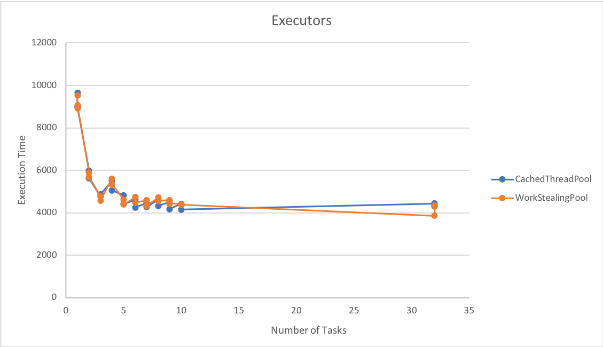

ANSWERS
==========

_Emma Arfelt Kock, ekoc_

_Anders Fischer, afin_

# Exercise 5

## 5.1

### 5.1.1
The results of running `Mark7` with a `CachedThreadPool` (with only 10 repeated tests due to time) are: 

````
# OS:   Mac OS X; 10.14; x86_64
# JVM:  Oracle Corporation; 11
# CPU:  null; 4 "cores"
# Date: 2018-09-28T10:58:59+0200
countSequential                    9002,5 us     154,69         32
9592.0
countParTask1     32               4434,5 us     123,74         64
9592.0
countParTask2     32               4376,4 us     199,77         64
9592.0
countParTask3     32               4312,4 us     154,25         64
9592.0
countParTask1      1               9639,1 us      23,57         32
countParTask1      2               5980,7 us      86,83         64
countParTask1      3               4779,9 us      38,40         64
countParTask1      4               5508,5 us     114,43         64
countParTask1      5               4812,8 us     140,38         64
countParTask1      6               4612,1 us      85,30         64
countParTask1      7               4465,7 us      74,33         64
countParTask1      8               4621,3 us      38,24         64
countParTask1      9               4511,3 us      50,64         64
countParTask1     10               4423,5 us      62,28         64
countParTask2      1               8993,8 us      59,43         32
countParTask2      2               5619,3 us      66,72         64
countParTask2      3               4857,7 us     351,42         64
countParTask2      4               5053,1 us     148,64         64
countParTask2      5               4405,2 us      42,08         64
countParTask2      6               4247,9 us      79,87         64
countParTask2      7               4253,4 us      70,35         64
countParTask2      8               4317,9 us      57,57         64
countParTask2      9               4169,9 us      60,06         64
countParTask2     10               4150,4 us      48,14         64
````

### 5.1.2
The results of running `Mark7` with a `WorkStealingPool` (with only 10 repeated tests due to time) are: 

````
# OS:   Mac OS X; 10.14; x86_64
# JVM:  Oracle Corporation; 11
# CPU:  null; 4 "cores"
# Date: 2018-09-28T11:02:54+0200
countSequential                    8906,5 us      23,62         32
9592.0
countParTask1     32               3853,3 us      38,03        128
9592.0
countParTask2     32               4333,8 us     162,61         64
9592.0
countParTask3     32               4281,1 us      59,24         64
9592.0
countParTask1      1               9524,1 us     105,05         32
countParTask1      2               5878,2 us      24,04         64
countParTask1      3               4768,5 us      67,09         64
countParTask1      4               5609,3 us      22,56         64
countParTask1      5               4627,4 us     153,73         64
countParTask1      6               4734,7 us     200,44         64
countParTask1      7               4586,0 us     170,52         64
countParTask1      8               4716,3 us      13,48         64
countParTask1      9               4594,2 us      70,82         64
countParTask1     10               4420,7 us      47,95         64
countParTask2      1               9072,3 us      58,06         32
countParTask2      2               5682,4 us     199,32         64
countParTask2      3               4576,6 us      11,66         64
countParTask2      4               5326,2 us      35,72         64
countParTask2      5               4388,8 us      28,06         64
countParTask2      6               4468,8 us      99,89         64
countParTask2      7               4321,9 us      73,15         64
countParTask2      8               4549,9 us      13,36         64
countParTask2      9               4416,4 us      55,37         64
countParTask2     10               4372,5 us      46,29         64
````

### 5.1.3



### 5.1.4
We see a speed-up using a thread pool instead of manually managing threads. This makes sense, since the threads are assigned work in the order that work is "created" instead of us "hogging" a certain number of threads and assigning work. 
We also see that the work-stealing pool is faster than the cached pool, which makes sense, since a given thread "being ahead" of the others can steal work and therefore the entire work is partitioned between threads more efficiently. 
It seems that the more cores you have, the more efficiently the threaded work happens. This is no surprise. We do see that if a high number of threads is forced, performance drops slightly since the OS has a decent overhead in swapping threads. 

### 5.1.5
The results of running Mark7 with a `WorkStealingPool` and `LongAdder` are: 

````
# OS:   Mac OS X; 10.14; x86_64
# JVM:  Oracle Corporation; 11
# CPU:  null; 4 "cores"
# Date: 2018-09-28T11:12:22+0200
countSequential                    8901,2 us      22,89         32
9592.0
countParTask1     32               4463,9 us      61,46         64
9592.0
countParTask2     32               4138,1 us     151,23         64
9592.0
countParTask3     32               4138,5 us      33,43         64
9592.0
countParTask1      1               9178,0 us     108,43         32
countParTask1      2               5601,3 us      13,78         64
countParTask1      3               4813,3 us      73,74         64
countParTask1      4               5358,2 us      60,10         64
countParTask1      5               4401,6 us      24,27         64
countParTask1      6               4622,1 us     112,81         64
countParTask1      7               4557,8 us      67,96         64
countParTask1      8               4793,0 us      89,53         64
countParTask1      9               5010,6 us     695,73         64
countParTask1     10               4520,7 us     332,07         64
countParTask2      1               9766,7 us     233,25         32
countParTask2      2               6400,2 us     446,72         64
countParTask2      3               4995,8 us      92,88         64
countParTask2      4               5525,0 us      97,07         64
countParTask2      5               5110,1 us     502,61         64
countParTask2      6               4758,6 us     162,56         64
countParTask2      7               4929,5 us     141,02         64
countParTask2      8               4923,0 us     232,55         64
countParTask2      9               4971,5 us     179,90         64
countParTask2     10               4407,3 us      84,01         64
```` 

We see that the `LongAdder` in a few instances perform better, but that it generally performs slightly worse than running with LongCounter and a `WorkStealingPool`. 

## 5.3

### 5.3.1
Woo, the code works. 

### 5.3.2
See `TestDownload.java`.

Code attached: 
````java
    public static Map<String, String> getPages(String[] urls, int maxLines) throws IOException {
        return Arrays.stream(urls).collect(Collectors.toMap(u -> u, u -> {
            try {
                return getPage(u, maxLines);
            } catch (IOException e) { return ""; }
        }));
    }
````

### 5.3.3

````
Times for testGetPages were:
3,172458 per 5x run of 23 pages.
2,030432 per 5x run of 23 pages.
1,792316 per 5x run of 23 pages.
1,589728 per 5x run of 23 pages.
1,579027 per 5x run of 23 pages.
10.182585558 for all runs combined.
```` 

### 5.3.4
See `TestDownload.java`.

Code attached: 
````java  
    public static Map<String, String> getPagesParallel(String[] urls, int maxLines) throws IOException {
        var tasks = new ArrayList<Callable<AbstractMap.SimpleEntry<String, String>>>();
        //There are no tuples in this horrible language. ^^^^^
        Arrays.stream(urls).forEach(u -> tasks.add(() -> new AbstractMap.SimpleEntry(u, getPage(u, maxLines))));

        TreeMap<String, String> toReturn = new TreeMap<String, String>();
        try {
            for (Future<AbstractMap.SimpleEntry<String, String>> e : executor.invokeAll(tasks)) {
                try {
                    AbstractMap.SimpleEntry<String, String> result = e.get();
                    toReturn.put(result.getKey(), result.getValue());
                } catch (Exception ex) { }
            }
        } catch (InterruptedException ie) { return null; }
        //We apologise for the nasty exception handling. Code was written to time on, not for actual correctness.

        return toReturn;
    }
````

```` 
Times for testGetPagesParallel were:
0,842269 per 5x run of 23 pages.
1,006780 per 5x run of 23 pages.
0,712039 per 5x run of 23 pages.
0,752190 per 5x run of 23 pages.
0,768670 per 5x run of 23 pages.
4.08320403 for all runs combined.
```` 
It _IS_ faster to run a lot af pages parallel a lot of times, so it _IS_ faster to fetch 23 pages in parallel, but it is not 23 times faster, due to overhead in swapping tasks and managing the thread pool, creating threads for tasks etc.


## 5.4

### 5.4.1
N/A - code ran fine.

### 5.4.2
See `TestPipeline.java`

Code attached: 
````java
    class Uniquifier<T> implements Runnable {
        private final BlockingQueue<T> input;
        private final BlockingQueue<T> output;
        private final HashSet<T> items;

        public Uniquifier(BlockingQueue<T> input, BlockingQueue<T> output) {
            this.output = output;
            this.input = input;
            this.items = new HashSet<>();
        }

        public void run() { 
            while (true) {
                T item = input.take();
                if (!items.contains(item)) { 
                    items.add(item); 
                    output.put(item); 
                }
            }
        }
    }
````

### 5.4.3
```java 
List<Future<?>> futures = new ArrayList<Future<?>>();

    Runnable t1 = new UrlProducer(urls);
    Runnable t21 = new PageGetter(urls, pages);
    Runnable t22 = new PageGetter(urls, pages);
    Runnable t3 = new LinkScanner(pages, uniqueLinks);
    Runnable t4 = new Uniquifier(uniqueLinks, refPairs);
    Runnable t5 = new LinkPrinter(refPairs);

    futures.add(executor.submit(t1));
    futures.add(executor.submit(t21));
    futures.add(executor.submit(t3));
    futures.add(executor.submit(t4));
    futures.add(executor.submit(t5));

    for (Future f : futures) {
      try {
        f.get();
      } catch (Exception e) {}
    }
```

### 5.4.4
````java
    final ExecutorService executor = Executors.newFixedThreadPool(6);
````

### 5.4.5
````java
    final ExecutorService executor = Executors.newFixedThreadPool(3);
````

### 5.4.6
````java
    Runnable pageGetter1 = new PageGetter(urls, pages);
    Runnable pageGetter2 = new PageGetter(urls, pages);
````

The order is different due to concurrent execution, so one thread might take work before the other when it's available. 

The results are the same since due to the fact that while one PageGetter is fetching a page, the other can submit to the queue and the pipeline can start processing. The amount of PageGetters does not matter.